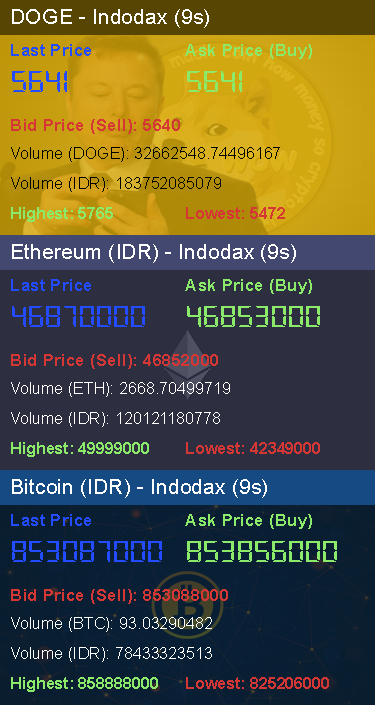

# Crypto Coin Monitor

A rainmeter plugin for monitoring crypto prices in real time 
These meters will update automatically every 10 seconds, individually 
<i>Internet is required to catch the JSON data, well, obviously</i> 
 
Will be expanding more coins and providers throughout the development 
 

